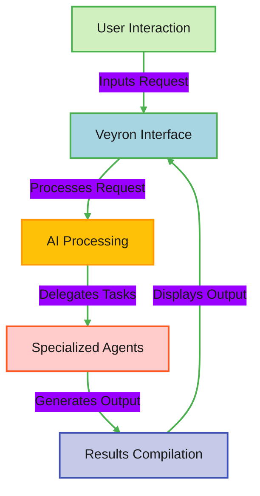

# Veyron MVP Workflow

```mermaid
%%{init: {'theme': 'base', 'themeVariables': { 'fontSize': '16px', 'fontFamily': 'Arial', 'primaryColor': '#ff9900', 'primaryTextColor': '#1a1a1a' }}}%%

graph TD
    U[User Interaction] --> |Inputs Request| V[Veyron Interface]
    V --> |Processes Request| P[AI Processing]
    P --> |Delegates Tasks| A[Specialized Agents]
    A --> |Generates Output| R[Results Compilation]
    R --> |Displays Output| V
    
    classDef user fill:#d0f0c0,stroke:#4caf50,stroke-width:2px;
    classDef interface fill:#a8d5e2,stroke:#4caf50,stroke-width:2px;
    classDef processing fill:#ffc107,stroke:#ff9800,stroke-width:2px;
    classDef agents fill:#ffcccb,stroke:#ff5722,stroke-width:2px;
    classDef results fill:#c5cae9,stroke:#3f51b5,stroke-width:2px;
    
    class U user;
    class V interface;
    class P processing;
    class A agents;
    class R results;

    linkStyle default stroke:#4caf50,stroke-width:2px;
```